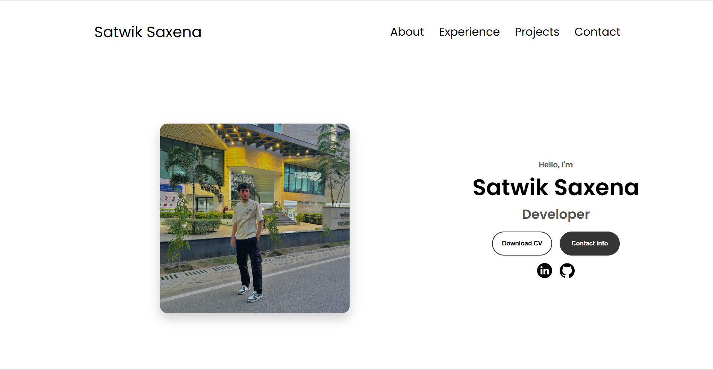
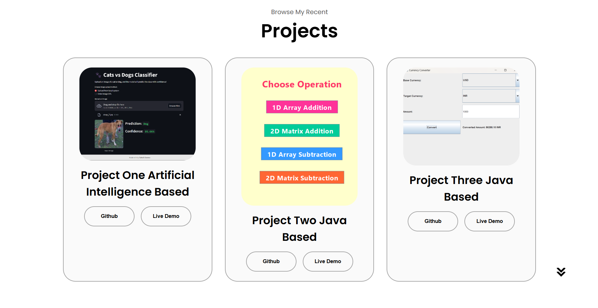
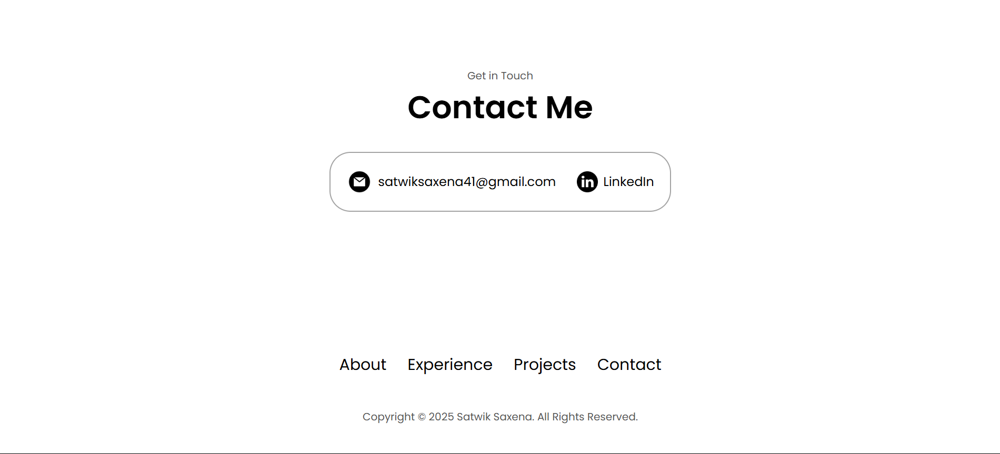

# 💼 Satwik Saxena - Developer Portfolio

This is a **personal portfolio website** for showcasing the projects, skills, and experience of **Satwik Saxena**. It is built using HTML, CSS, and JavaScript, and is deployed using **Firebase Hosting**.

---

## 📁 Project Structure

```
/
├── index.html               # Main HTML file
├── style.css                # Main CSS styles
├── mediaqueries.css         # Responsive styles
├── script.js                # JavaScript for mobile menu toggle
├── assets/                  # Images, resume, and icons used in the site
├── firebase.json            # Firebase Hosting config
├── .firebaserc              # Firebase project ID config
└── README.md                # You're reading it!
```

---

## 🌐 Live Demo

You can view the portfolio here:  
➡️ [https://website-af6b9.web.app](https://website-af6b9.web.app) 

---

## 🚀 Features

- **Responsive Design** with `mediaqueries.css`
- **Navigation Bar** (desktop and hamburger menu for mobile)
- **Profile Section** with profile picture, name, role, and contact buttons
- **About Me Section** with education and skill highlights
- **Experience Section** listing key technologies
- **Projects Section** with GitHub links and live demos
- **Contact Section** with email and LinkedIn
- **Smooth Scrolling and Interactive UI**

---

## 🛠️ Technologies Used

- **HTML5**
- **CSS3**
- **JavaScript (Vanilla)**
- **Firebase Hosting**

---

## 🧑‍💻 How to Run Locally

1. **Clone this repository**

```bash
git clone https://github.com/yourusername/portfolio.git
cd portfolio
```

2. **Install Firebase CLI**

```bash
npm install -g firebase-tools
```

3. **Login to Firebase**

```bash
firebase login
```

4. **Initialize Firebase (if not done)**

```bash
firebase init
```

*(Skip if `.firebaserc` and `firebase.json` are already present)*

5. **Deploy**

```bash
firebase deploy
```

Your website will be deployed to Firebase Hosting.

---

## 🧾 Firebase Hosting Configuration

### `firebase.json`
```json
{
  "hosting": {
    "public": ".",
    "ignore": [
      "firebase.json",
      "**/.*",
      "**/node_modules/**"
    ]
  }
}
```

### `.firebaserc`
```json
{
  "projects": {
    "default": "your-firebase-project-id"
  }
}
```
*(Replace `your-firebase-project-id` with your actual Firebase project ID)*

---

## Screenshots

### Home Page


### About Page


### Project Page


### Contact Page

---

## Author

**Satwik Saxena**  
📧 [satwiksaxena41@gmail.com](mailto:satwiksaxena41@gmail.com)  
🔗 [LinkedIn](https://www.linkedin.com/in/satwik-12-dev)  
💻 [GitHub](https://github.com/satwik12-dev)

---

## 📄 License

This project is open source and available under the [MIT License](LICENSE).